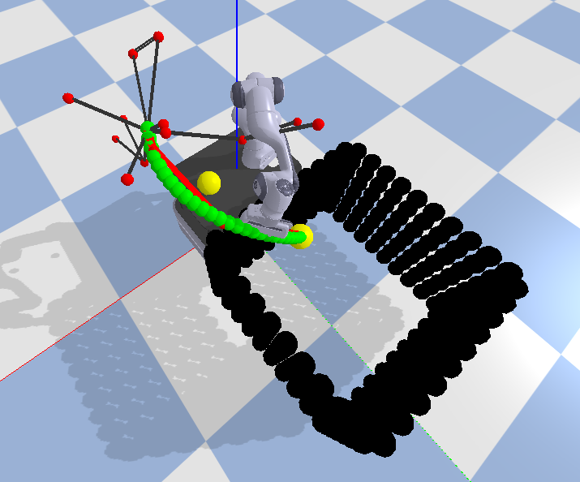
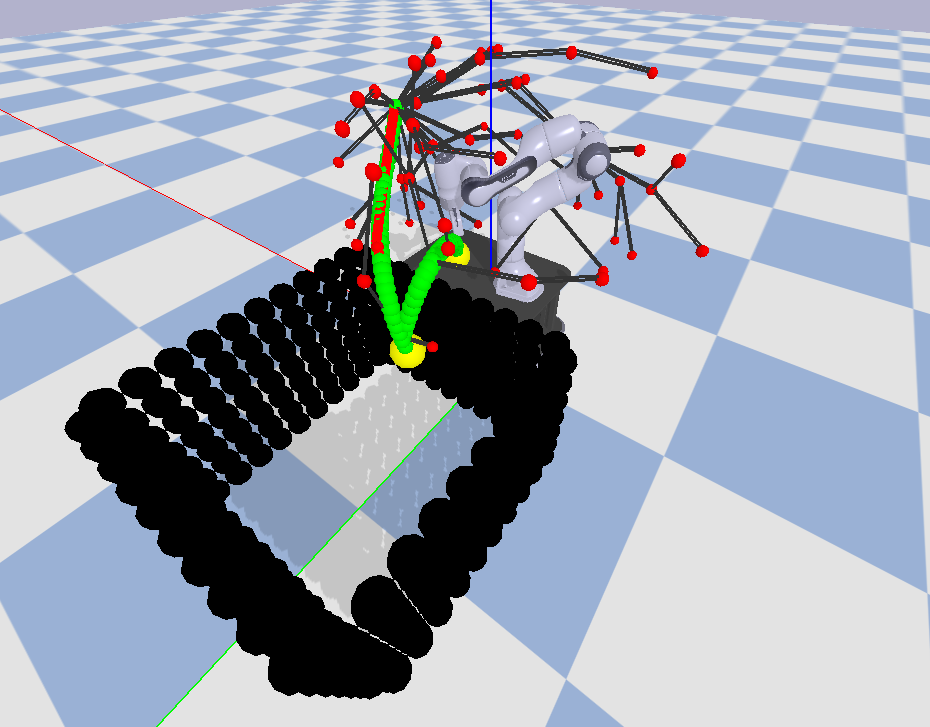
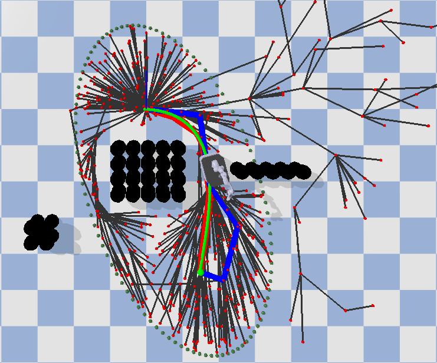
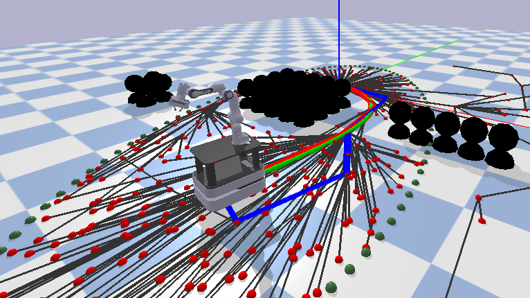

# Autonomous Warehouse Robot
The robotic system is designed to operate within a warehouse environment. The robot, named Albert, is capable of autonomous navigation. The repository is structured to separate the functionalities of the arm control, base movement, environment setup, and the full robot model.

## Repository Structure

```plaintext
PROJECT/
├── arm_model/
│   ├── control_arm.py
│   ├── kinematics_arm.py
│   └── operate_arm.py
├── environments/
│   └── create_environments.py
├── full_robot_model/
│   ├── ab_control.py
│   ├── ab_kinematics.py
│   ├── ab_operate.py
│   └── main_ab.py
├── global_path/
│   └── RRT_global.py
├── mobile_base/
│   └── pid_control.py
├── path_planning/
│   └── RRT_global.py
├── main_arm.py
├── main_base.py
├── main.py
└── README.md
```

## Installation
Before proceeding, ensure that you have Conda installed on your system. If you do not have Conda installed, you can download and install it from [Miniconda](https://docs.conda.io/en/latest/miniconda.html) or [Anaconda](https://www.anaconda.com/products/individual).


1. Clone the repository:

   ```bash
   git clone git@github.com:Hobsyllvin/PDM_project.git
    ```

2. **Create the Environment**: Run the following command to create the Conda environment:

   ```bash
   conda env create -f conda_env_group20.yml
    ```

3. **Open Terminal or Command Prompt**: Navigate to the directory where the `conda_env_group20.yml` file is located.

4. **Activate the Environment**: Run the following command to activate the Conda environment:

   ```bash
   conda activate PDM
   ```


## Usage
To run the autonomous robot simulation, execute the main scripts provided for different sections of the robot:

- `main_arm.py`: For testing the arm's path planning and object manipulation. It initializes the arm control, computes kinematics, and sets up the simulation environment with obstacles. Then it utilizes RRT* for path planning and PID control for arm movement.
- `main_base.py`: For testing the base's navigation and obstacle avoidance. It sets up a mobile base in the gymnasium environment, navigates through obstacles using Informed RRT*, and visualizes the path and actions over time.
- `main.py`: For full robot simulation including both arm and base operations. It combines functionalities of the arm and base to perform complete tasks, including reaching target positions and handling objects

For example, to run the full robot simulation:

```bash
python3 main.py
```

## Visualization

When running the scripts, they will render a simulation environment that allows you to track the robot's performance visually. Below are some snapshots of what you should expect to see:

### Arm Path Planning Visualization

<div style="text-align: center;">
  
  <p>Arm Path Planning (First Target)</p>
</div>
<div style="text-align: center;">
  
  <p>Arm Path Planning (Second Target)</p>
</div>

### Base Navigation Visualization

<div style="text-align: center;">
  
  <p>Base Navigation (Topview)</p>
</div>
<div style="text-align: center;">
  
  <p>Base Navigation (Sideview)</p>
</div>

## Authors
- Jakob Bichler
- Nicolas Wim Landuyt
- Christian Reinprecht 
- Korneel Somers
